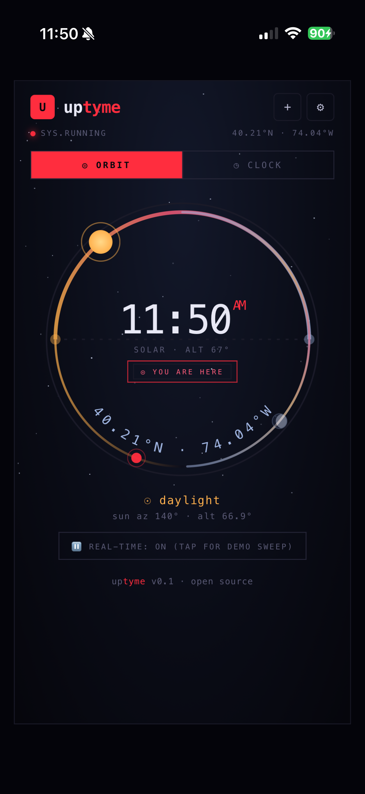
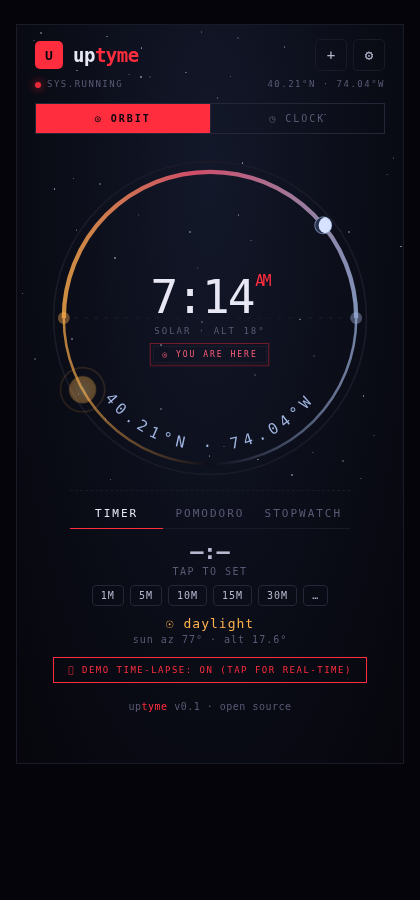

# uptyme

Dual-mode time instrument. The **time** axis of codereimagine.

Live: [codereimagine.github.io/uptyme](https://codereimagine.github.io/uptyme/)

By **Bert Peters**.

## Screenshots

<table>
  <tr>
    <th>Mobile</th>
    <th>Desktop</th>
  </tr>
  <tr>
    <td></td>
    <td></td>
  </tr>
  <tr>
    <td colspan="2"><sub>Watch face floating in a full-bleed starfield. Optional second-city readout beneath.</sub></td>
  </tr>
</table>

## What it does

- A watch — your local time, presented as the primary instrument.
- Optional **second city** — one elsewhere place pinned beneath the face.
- Full-bleed starfield atmosphere; the instrument floats, scale-to-fit.
- Installable PWA; works offline once cached.
- Local-first: on-device astronomy, **zero runtime network**.

## Stack

React 18 · Vite · TypeScript · vite-plugin-pwa (Workbox).

## Develop

```sh
npm install
npm run dev       # http://localhost:5173
npm run build     # tsc -b && vite build
npm run preview   # serves the production bundle on :4275
npm run test
```

## Project layout

```
src/
  faces/         # Clock, Orbit, and other instrument faces
  components/   # TimerStrip, Settings, and shared UI
  hooks/        # useTimer, useStopwatch, usePomodoro
  store/        # settings store (persisted)
  pomodoro.ts   # pomodoro logic
  timer.ts      # countdown timer logic
  stopwatch.ts  # stopwatch logic
public/         # PWA manifest + icons
docs/
  screenshots/  # README images
```

## Related

uptyme is one of three axes of codereimagine:

- **[bewthr](https://github.com/codereimagine/bewthr)** — continuum (weather)
- **uptyme** — time
- **[starnav](https://github.com/codereimagine/starnav)** — space

## License

Apache License 2.0 — see [LICENSE](./LICENSE).
