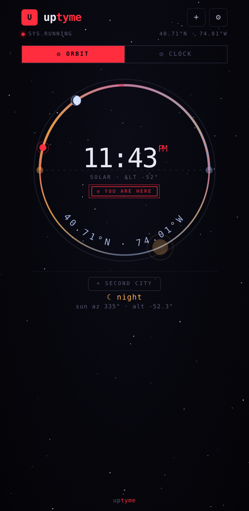
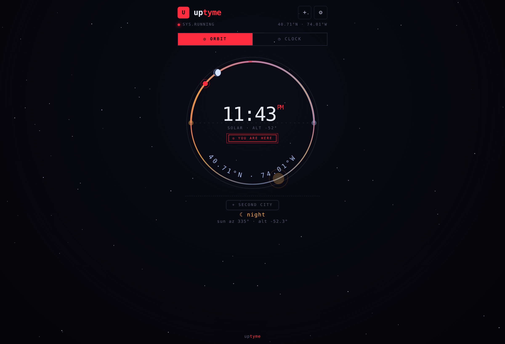

<div align="center">

# uptyme

### A watch for your place on Earth — real sun, moon, and time, computed on your device.

*No accounts, no trackers, no ads — private by design.*

**▶ Live — [codereimagine.github.io/uptyme](https://codereimagine.github.io/uptyme/)**

<p>
  
  
</p>

<sub>The watch face floating in a full-bleed starfield — solar altitude, your coordinates, an optional second city.</sub>

<br>


<sub><b>Lighthouse (desktop) — 100 · 100 · 100 · 100</b></sub>

**By Bert Peters** · the **time** axis of [codereimagine](https://github.com/codereimagine).

</div>

---

A watch as the primary instrument: your local time with the sun's real position for your exact place — all computed on-device, no servers. Two faces: **Orbit** (the sun around your horizon) and **Clock** (a classic dial).

## What it does

- **A watch, geolocated.** First load asks the browser for your coordinates so the watch knows where you are — the geolocation API is a local browser primitive, no network. Deny it and you get Greenwich (the zero meridian) as a graceful fallback.
- **Two faces.** *Orbit* shows the sun's position around the horizon; *Clock* is a classic dial. Your local time is always the headline.
- **Optional second city.** Pin one more place beneath the face. Search any city worldwide; the result carries its own IANA timezone, so the readout stays DST-correct.
- **Atmospheric starfield.** Full-bleed, the instrument floats and scales to fit any screen.
- **Installable PWA.** Works offline once cached.
- **Private by design — no accounts, no trackers, no ads.** Zero runtime network for the watch itself; the only outbound call in the whole app is the city search you explicitly trigger. Nothing about you leaves your device.

## How it computes — all local, no network

- **Sun position, altitude & bands** — NOAA Solar Position Algorithm (Meeus ch. 25), implemented in `src/engine.ts`, verified byte-faithful against the reference harness it ports from.
- **Moon phase** — Meeus ch. 49, true new/full-moon instants, also in `src/engine.ts`.
- **Timezone math** — the device's `Intl.DateTimeFormat` for your place; for searched cities, the IANA zone the geocoder returns.
- **City search (only when you type it)** — [Open-Meteo geocoding](https://open-meteo.com/en/docs/geocoding-api), keyless. The single outbound fetch in the app, in `src/lib/geocode.ts`.

## Tech

React 18 · Vite · TypeScript · `vite-plugin-pwa` (Workbox) · Vitest. A PWA — installable and offline-capable.

## Run it locally

```sh
npm install
npm run dev       # http://localhost:5173
npm run build     # tsc -b && vite build
npm run preview   # serve the production bundle
npm run test      # Vitest — includes the Meeus/NOAA verification
```

## The codereimagine trilogy

uptyme is one of three axes of [codereimagine](https://github.com/codereimagine):

- **[bewthr](https://github.com/codereimagine/bewthr)** — continuum (weather)
- **uptyme** — time
- **[starnav](https://github.com/codereimagine/starnav)** — space

## License

Apache-2.0.
